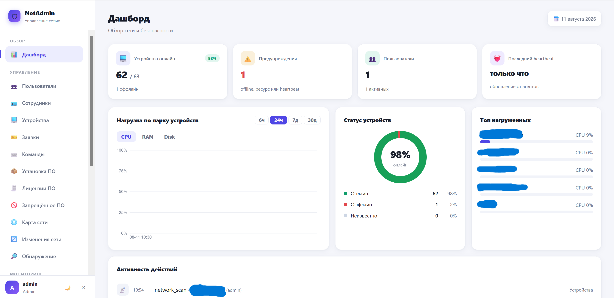
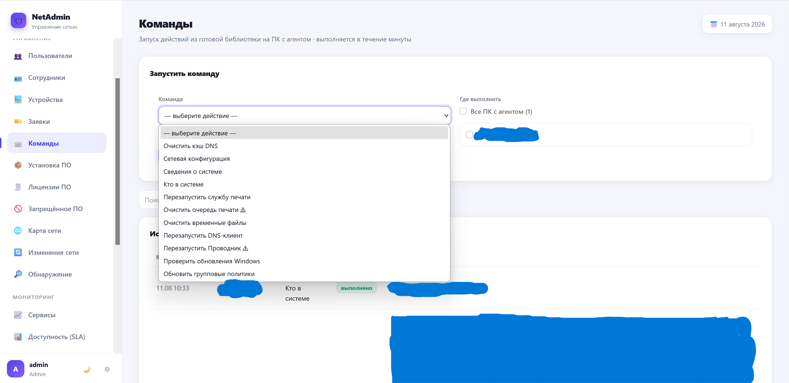
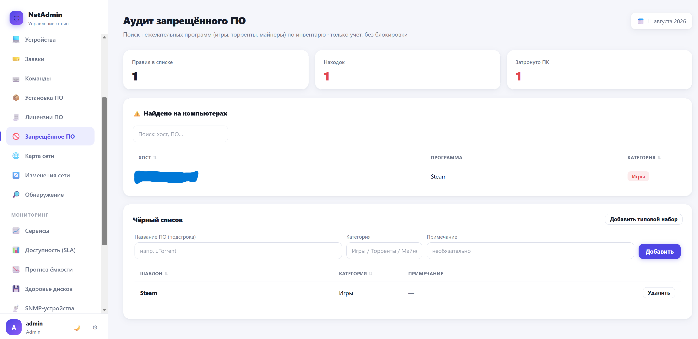

# NetAdmin

[](https://github.com/abdlvmx/NetAdmin/releases/latest)


Учёт и мониторинг ИТ-инфраструктуры для организации **без домена**. Один статичный
`.exe` — сервер с веб-интерфейсом, плюс лёгкий агент для устройств. Без cgo, без
Python, без внешних служб: шаблоны, статика и база лежат внутри бинарника или рядом
с ним.

**Посмотреть за минуту:** скачайте `netadmin.exe` из
[релизов](https://github.com/abdlvmx/NetAdmin/releases/latest) и запустите
`netadmin.exe -demo` — откроется браузер с заполненной панелью. Ничего
устанавливать не нужно, сеть не сканируется. Подробнее — [ниже](#попробовать).



<sub>Здесь и далее скриншоты сняты на вымышленных данных — тех же, что показывает
`netadmin.exe -demo`. Реальных сведений организации на них нет.</sub>

## Зачем

Написан для организации, где нет Active Directory, а значит недоступны инструменты
инвентаризации и мониторинга, завязанные на GPO и доменные политики. Задача была
закрыть базовые вопросы ИТ-службы: какие устройства есть в сети, что на них
установлено, живы ли сервисы и кто оставил заявку — без сложной инфраструктуры.

> Это система **учёта и наблюдаемости**, а не средство защиты информации. Здесь нет
> детектирования угроз, контроля USB, анализа защищённости и прочих функций СЗИ.
> Подробнее о модели применения — в [docs/security.md](docs/security.md).

## Возможности

| Раздел | Что делает |
|---|---|
| **Дашборд** | сводка «Требует внимания» одним списком: устройства, сервисы, SNMP, диски — со ссылкой в свой раздел; нагрузка по парку, статус, топ нагруженных |
| **Поиск** | `Ctrl+K` с любой страницы: имя ПК, IP, MAC, сотрудник, кабинет, установленная программа, заявка — в одной строке |
| **Устройства** | инвентарь с фильтрами и поиском, групповые операции над выборкой, ping, скан портов, графики нагрузки, привязка к сотруднику, история изменений железа и ПО |
| **Карта сети** | устройства блоками по типу или подсети, связи из раздела «Зависимости», панель проблемных узлов |
| **Обнаружение** | новые хосты из ARP-кэша без активного скана: добавить, отметить гостем или игнорировать |
| **SNMP** | коммутаторы, ИБП и принтеры: статус портов, заряд батарей, уровень тонера; письмо, когда тонер заканчивается или ИБП перешёл на батарею |
| **Заявки** | публичный портал `/help` без логина, отслеживание по коду, комментарии, статусы, письма заявителю |
| **Команды** | готовый список действий на удалённых ПК (очистка кэша DNS, перезапуск службы печати и другие) |
| **Установка ПО** | раздача дистрибутивов на выборку машин и обновление самого агента (только администратор) |
| **Мониторинг** | проверки HTTP/TCP/DNS/SMTP/IMAP/RDP, доступность за период, здоровье дисков по SMART, прогноз заполнения |
| **Учёт** | сотрудники и отделы, лицензии ПО против фактического использования, чёрный список нежелательных программ |
| **Администрирование** | три роли, журнал действий, резервные копии базы по расписанию |

<details>
<summary>Ещё скриншоты</summary>

Карта сети


Карточка устройства


Команды



Запрещённое ПО



</details>

## Попробовать

Запустите скачанный файл двойным щелчком — он спросит, чего вы хотите:

```
  1  Посмотреть на примере — вымышленные данные, вашу сеть не трогаем
  2  Настроить для своей организации
  3  Установить службой, чтобы работал постоянно
```

Первый вариант — он же по умолчанию, достаточно нажать Enter — откроет браузер
с готовой панелью на вымышленных данных: девять устройств, сотрудники, заявки,
история метрик, проблемные диски. Вход — `admin` / `Parol12345`. Из командной
строки то же самое даёт флаг `-demo`.

Демо живёт во временной базе в системном `%TEMP%` и удаляет её при выходе
(`Ctrl+C`), слушает только `127.0.0.1` и намеренно не выполняет ничего из фоновой
работы сервера: ни сканирования сети, ни ping, ни опроса SNMP, ни писем. Ваша сеть
о запуске не узнает.

## Установка

```powershell
# 1. Двойной щелчок по netadmin.exe -install — Windows сама спросит права.
#    Сервер станет службой, база уедет в C:\ProgramData\NetAdmin,
#    установщик предложит открыть порт 8765 в брандмауэре.
.\netadmin.exe -install

# 2. Откроется браузер: создайте администратора.
#    Затем Настройки → «Установить агент на этот компьютер» — одна кнопка.

# 3. На остальных компьютерах — одна строка в PowerShell от администратора.
#    Готовую команду с вашим адресом и токеном показывает раздел «Настройки»:
powershell -c "$t='ТОКЕН'; irm http://192.168.1.10:8765/enroll.ps1 | iex"
```

Агент едет внутри `netadmin.exe`: сервер отдаёт его сам, загружать ничего не
нужно. Скрипт скачивает агента с вашего же сервера, сверяет контрольную сумму,
ставит службой и регистрирует устройство.

Ключ в команде — **одноразовый код**: задаёте срок и число установок, и он сам
перестаёт действовать. Оставшаяся в истории консоли или в переписке строка через
час уже ничего не открывает. Постоянный токен тоже остался — он нужен скриптам
раскатки и `install_agent.bat`.

Если PowerShell на устройствах закрыт политикой, в «Настройках» остаются два
запасных пути: прямая ссылка на `agent.exe` (двойной щелчок, затем
`agent.exe -install -server=… -token=…`) и старый `install_agent.bat` с уже
вписанными адресом и токеном.

| Команда | Сервер | Агент |
|---|---|---|
| Установить службой | `netadmin.exe -install` | `agent.exe -install -server=… -token=…` |
| Удалить службу | `netadmin.exe -uninstall` | `agent.exe -uninstall` |
| Состояние | `netadmin.exe -status` | `agent.exe -check` |
| Перезапустить | `netadmin.exe -restart` | — |

`agent.exe -check` можно не запускать на месте: кнопка **«Самодиагностика»** на
карточке устройства просит агента прогнать ту же проверку и присылает отчёт во
вкладку «Действия». Машине, которая до сервера не достучалась вовсе, это не
поможет — она и задачу не заберёт.

Права администратора запрашиваются через UAC — открывать консоль «от имени
администратора» заранее не нужно. Для раскатки скриптом есть `-firewall`
и `-no-firewall`, чтобы установщик не задавал вопросов.

Удаление службы не трогает накопленные данные: база, настройки и резервные
копии остаются в `C:\ProgramData\NetAdmin`.

Что агент собирает, какие права ему нужны и как его снять — в
[руководстве по развёртыванию](docs/deploy.md).

Сервер слушает `0.0.0.0:8765`, чтобы агенты подключались с любых интерфейсов, но
обслуживает **только разрешённые подсети** — по умолчанию локальные и частные.
Запрос с публичного адреса отбивается на входе. Веб-интерфейс — `http://127.0.0.1:8765`.

> ⚠️ Обмен идёт по обычному HTTP: продукт рассчитан на изолированный сегмент
> локальной сети и намеренно не применяет криптографическую защиту канала.
> Это проектное решение со своими последствиями — см. [docs/security.md](docs/security.md).

<details>
<summary>Сборка из исходников</summary>

Нужен Go 1.26.6 или новее — версия зафиксирована в `go.mod`. Ни cgo, ни Python,
ни внешних служб; зависимости тянутся модулями:

```powershell
go build -o netadmin.exe ./cmd/netadmin
go build -o agent.exe    ./cmd/agent
```

Кросс-компиляция под Windows из другой ОС и запуск сервера службой —
в [docs/deploy.md](docs/deploy.md).

</details>

## Роли доступа

| Раздел или действие | viewer | user | admin |
|---|:---:|:---:|:---:|
| Просмотр дашборда, устройств, сотрудников, мониторинга | ✅ | ✅ | ✅ |
| Профиль, смена своего пароля | ✅ | ✅ | ✅ |
| Правка устройств, ping, скан сети, обнаружение, групповые операции | ❌ | ✅ | ✅ |
| Запуск команд из библиотеки на удалённых ПК | ❌ | ✅ | ✅ |
| Загрузка и раздача ПО, обновление агентов | ❌ | ❌ | ✅ |
| Удаление устройств, пользователи, настройки, журнал действий | ❌ | ❌ | ✅ |

## Документация

- [Развёртывание](docs/deploy.md) — сборка, запуск сервера, переменные окружения,
  установка агентов, массовая раскатка, брандмауэр
- [Безопасность](docs/security.md) — модель применения, что защищено, что осознанно
  оставлено открытым и чем это компенсируется
- [Эксплуатация](docs/operations.md) — резервные копии, обновление агентов,
  уведомления, хранение данных, производительность

## Структура проекта

```
.
├── cmd/
│   ├── netadmin/      точка входа сервера (HTTP, фоновые задачи)
│   ├── agent/         агент: метрики и инвентарь ПО, служб, автозагрузки, задач
│   ├── seed/          инструмент разработчика: наполнение базы для просмотра интерфейса
│   └── icongen/       инструмент разработчика: значок продукта (.exe, вкладка браузера)
├── internal/
│   ├── agentbin/      сборка агента, встроенная в сервер (go:embed)
│   ├── auth/          пароли, сессии, текущий пользователь, аудит
│   ├── backup/        резервные копии базы (VACUUM INTO) с ротацией
│   ├── config/        пути, config.json, токен агента, константы хранения
│   ├── db/            открытие SQLite (WAL) и схема
│   ├── demo/          вымышленные данные для `-demo` и cmd/seed
│   ├── handlers/      HTTP-обработчики по доменам
│   ├── ingest/        пакетная запись метрик и событий
│   ├── monitor/       проверки доступности сервисов
│   ├── netaccess/     ограничение доступа по подсетям
│   ├── netiface/      выбор адреса, по которому агенты видят сервер
│   ├── netscan/       ping и сканирование сети (ICMP + ARP)
│   ├── notify/        уведомления по SMTP
│   ├── snmp/          опрос сетевого оборудования
│   ├── tz/            московское время для отображения
│   ├── web/           встроенные шаблоны и статика (go:embed)
│   └── winsvc/        установка и запуск службами Windows (сервер и агент)
├── deploy/            install_agent.bat, uninstall_agent.bat, firewall_server.bat
└── go.mod
```

## Лицензия

MIT — см. [LICENSE](LICENSE).
